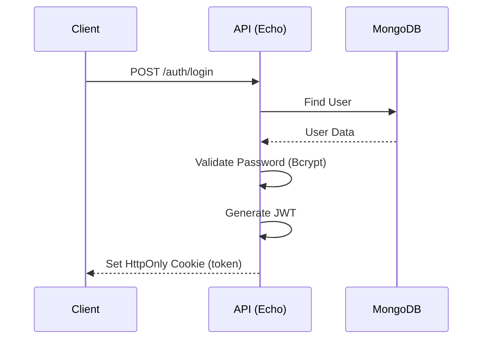

<div align="center">
  
  <h2>Backend Service</h2>
  <p><strong>Robust Scalable Event Management API</strong></p>
  <p>The core engine powering the <strong>Event Horizon</strong> platform. Built with <strong>Go</strong> and <strong>Echo</strong>, this service handles authentication, event scheduling, ticket inventory management, and secure booking transactions with MongoDB.</p>
</div>

<div align="center">
    
  [](https://go.dev/)
  [](https://echo.labstack.com/)
  [](https://www.mongodb.com/)
  [](https://jwt.io/)
  [](https://www.heroku.com/)
</div>

<br />

## ✨ Features

- **🔐 Secure Authentication**: JWT-based auth with secure HttpOnly cookies.
- **📅 Event Management**: Complete CRUD for events with start/end times & location data.
- **🎟️ Smart Ticketing**:
  - Multiple ticket types (VIP, Regular, Student).
  - Real-time inventory tracking (`TotalQuantity` vs `AvailableQuantity`).
- **💳 Transactional Bookings**: ACID transactions for booking integrity (pending/confirmed/cancelled statuses).
- **👥 Role-Based Access**: Distinct `User` and `Host` capabilities.


## 🛠️ Tech Stack

<div align="center">

|                                              Core                                               |                                                 Database                                                  |                                                 Infra                                                  |
| :---------------------------------------------------------------------------------------------: | :-------------------------------------------------------------------------------------------------------: | :----------------------------------------------------------------------------------------------------: |
| <br/>**Go 1.25** | <br/>**MongoDB** | <br/>**Heroku** |

</div>

## 🗺️ Authentication Flow



## 🛠️ API Reference

| Resource     | Method | Endpoint               | Description       | Access           |
| :----------- | :----- | :--------------------- | :---------------- | :--------------- |
| **Auth**     | POST   | `/auth/register`       | Register new user | Public           |
|              | POST   | `/auth/login`          | Login user        | Public           |
| **Events**   | GET    | `/events/all`          | List all events   | Public           |
|              | POST   | `/events/create`       | Create new event  | Protected (Host) |
|              | DELETE | `/events/:id`          | Delete event      | Protected (Host) |
| **Bookings** | POST   | `/bookings/create`     | Book a ticket     | Protected        |
|              | GET    | `/bookings/user`       | User's bookings   | Protected        |
|              | PUT    | `/bookings/:id/cancel` | Cancel booking    | Protected        |

## 🚀 Getting Started

### Prerequisites

- **Go 1.25+**
- **MongoDB** (Local or Atlas)

### 1. Clone & Setup

```bash
git clone https://github.com/yourusername/event-horizon-backend.git
cd Backend
go mod download
```

### 2. Environment Configuration

Create a `.env` file in the root directory:

```env
MONGO_URI=mongodb+srv://<user>:<password>@cluster.mongodb.net/?retryWrites=true&w=majority
PORT=3000
DATABASE_NAME=EventHorizonDB
JWT_SECRET=your-super-secret-jwt-key
```

### 3. Run Locally

```bash
go run main.go
```

The server will start at `http://localhost:3000`.

## 🌐 Deployment (Heroku)

This backend is optimized for Heroku deployment.

1.  **Create App**: `heroku create event-horizon-api`
2.  **Set Env Vars**:
    ```bash
    heroku config:set MONGO_URI="your_mongo_uri"
    heroku config:set JWT_SECRET="your_secret"
    ```
3.  **Deploy**:
    ```bash
    git push heroku main
    ```
